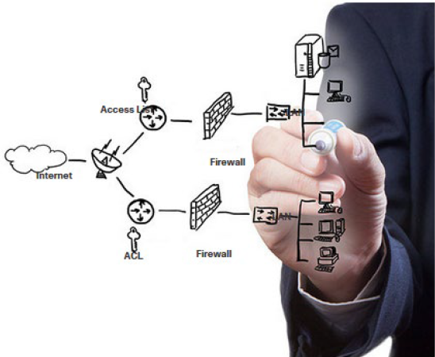
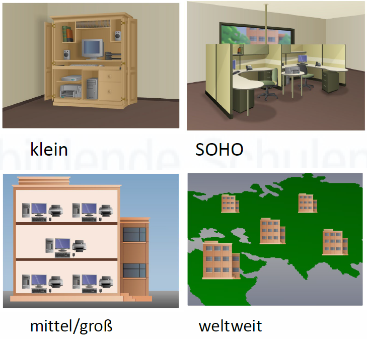

# 1. Netzwerk-Grundlagen

⬅️ Previous | [📚 Overview](README.md) | [Next ➡️](2.Netzwerktopologien.md)

---

## Was ist ein Netzwerk?

Ein Netzwerk verbindet mehrere Geräte miteinander, damit sie Daten austauschen und gemeinsame Ressourcen nutzen können.

Dabei können die Geräte entweder direkt miteinander verbunden sein oder über Netzwerkgeräte wie Switches, Router oder Access Points kommunizieren.

Beispiele:

- Ein PC greift auf einen Netzwerkdrucker zu.
- Ein Laptop ruft eine Webseite im Internet auf.
- Ein Smartphone verbindet sich mit dem WLAN.
- Ein PC bekommt automatisch eine IP-Adresse von einem DHCP-Server.
- Mehrere PCs greifen auf gemeinsame Dateien auf einem Server zu.

Ein Netzwerk kann sehr klein sein, zum Beispiel ein Heimnetzwerk, oder sehr groß, wie das Internet.

---

## Wichtige Begriffe

| Begriff | Erklärung |
|---|---|
| **Client** | Ein Gerät oder Programm, das einen Dienst anfordert. Beispiel: Ein PC ruft eine Webseite auf. |
| **Server** | Ein Gerät oder Programm, das einen Dienst bereitstellt. Beispiel: Ein Webserver liefert Webseiten aus. |
| **Endgerät** | Ein Gerät, das von einem Benutzer verwendet wird oder Dienste nutzt/anbietet. Beispiel: PC, Laptop, Drucker, Smartphone, Server. |
| **Zwischengerät** | Ein Gerät, das Daten im Netzwerk weiterleitet oder Verbindungen ermöglicht. Beispiel: Switch, Router, Access Point, Firewall. |

### Client und Server einfach erklärt

Ein **Client** stellt eine Anfrage, ein **Server** antwortet darauf.

Beispiel:

1. Du öffnest im Browser `www.google.de`.
2. Dein Browser ist der **Client**.
3. Der Google-Webserver ist der **Server**.
4. Der Server sendet die Webseite zurück an deinen Browser.

Wichtig: Ein Gerät kann auch gleichzeitig Client und Server sein.  
Ein PC kann zum Beispiel eine Webseite aufrufen, also Client sein, und gleichzeitig Dateien für andere Geräte freigeben, also Server-Funktion übernehmen.

---

## Endgeräte und Zwischengeräte

### Endgeräte

Endgeräte sind die Geräte, mit denen Benutzer direkt arbeiten oder die Dienste bereitstellen.

Beispiele:

- PC
- Laptop
- Smartphone
- Tablet
- Drucker
- Server
- IP-Telefon

Sie befinden sich meistens „am Rand“ des Netzwerks.

### Zwischengeräte

Zwischengeräte sorgen dafür, dass Daten den richtigen Weg durch das Netzwerk finden.

Beispiele:

- **Switch**: Verbindet Geräte innerhalb eines LANs.
- **Router**: Verbindet verschiedene Netzwerke miteinander, z. B. Heimnetz und Internet.
- **Access Point**: Ermöglicht WLAN-Verbindungen.
- **Firewall**: Kontrolliert und filtert Netzwerkverkehr.

---

## Netzwerktypen

| Netzwerktyp | Bedeutung | Beispiel |
|---|---|---|
| **LAN** | Local Area Network, lokales Netzwerk in einem begrenzten Bereich | Heimnetz, Schulnetz, Firmennetz |
| **WAN** | Wide Area Network, großes Netzwerk über weite Strecken | Internet, Verbindung zwischen Firmenstandorten |

### LAN

Ein **LAN** ist ein lokales Netzwerk. Es befindet sich meist in einem Gebäude oder auf einem Gelände.

Beispiele:

- Netzwerk zu Hause
- Netzwerk in der Schule
- Netzwerk in einer Firma

In einem LAN sind Geräte oft über Netzwerkkabel oder WLAN miteinander verbunden.

### WAN

Ein **WAN** verbindet Netzwerke über große Entfernungen. Das bekannteste WAN ist das Internet.

Beispiel:

Eine Firma hat Standorte in Berlin und München. Beide Standorte haben jeweils ein eigenes LAN. Werden diese Netzwerke miteinander verbunden, entsteht eine WAN-Verbindung.

---

## Weitere Netzwerkarten

### Intranet

Ein **Intranet** ist ein interner Verbund von LANs und WANs, auf den nur Mitglieder der Organisation oder berechtigte Personen zugreifen können.

Merksatz: Intranet = „intern geschlossenes Internet"

### Extranet

Ein **Extranet** ermöglicht Personen von außerhalb der Organisation einen gesicherten und kontrollierten Zugriff auf Teile des internen Netzwerks.

Beispiel: Ein Lieferant bekommt gesicherten Zugang zum Bestellsystem einer Firma.

### Netzwerkgrößen im Überblick

| Größe | Bezeichnung | Beispiel |
|---|---|---|
| Klein | Heimnetzwerk | 2–3 Geräte zu Hause |
| SOHO | Small Office / Home Office | Heimarbeit mit Verbindung ins Firmennetz |
| Mittel / Groß | Unternehmensnetzwerk | mehrere Gebäude, viele Standorte |
| Weltweit | Internet | Millionen vernetzter Computer weltweit |

**SOHO** steht für **Small Office / Home Office** und bezeichnet Netzwerke in kleinen Büros oder Heimbüros, die oft eine Verbindung zu einem größeren Unternehmensnetzwerk herstellen.

---

## Merksätze

- Ein Netzwerk verbindet Geräte zum Datenaustausch.
- Ein Client fordert Dienste an.
- Ein Server stellt Dienste bereit.
- Endgeräte nutzen oder bieten Dienste an.
- Zwischengeräte leiten Daten weiter.
- Ein LAN ist ein lokales Netzwerk.
- Ein WAN verbindet Netzwerke über große Entfernungen.
- Ein Intranet ist ein geschlossenes internes Netzwerk.
- Ein Extranet erlaubt kontrollierten externen Zugriff.
- SOHO = kleines Büro oder Heimbüro mit Netzwerkanbindung.

---

## Abfragefragen

1. Was ist ein Netzwerk?
2. Nenne drei Beispiele für die Nutzung eines Netzwerks.
3. Was ist der Unterschied zwischen Client und Server?
4. Was ist ein Endgerät?
5. Nenne drei Beispiele für Endgeräte.
6. Was ist ein Zwischengerät?
7. Nenne drei Beispiele für Zwischengeräte.
8. Was macht ein Switch?
9. Was macht ein Router?
10. Was ist der Unterschied zwischen LAN und WAN?
11. Was ist ein Intranet?
12. Was ist ein Extranet?
13. Was bedeutet SOHO?

---

⬅️ Previous | [📚 Overview](README.md) | [Next ➡️](2.Netzwerktopologien.md)
