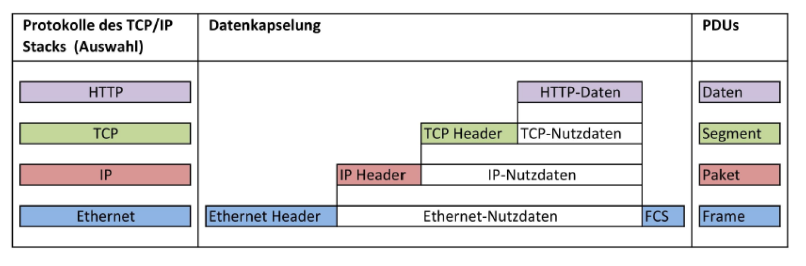

# 11. PDU, Kapselung und Entkapselung

[⬅️ Previous](10. ARP.md) | [📚 Overview](README.md) | [Next ➡️](12. Network Layer und IP.md)

---

## PDU

PDU bedeutet:

```text
Protocol Data Unit
```

Das ist die Dateneinheit einer bestimmten Netzwerkschicht.

| OSI-Schicht | PDU |
|---|---|
| Application | Daten |
| Transport | Segment |
| Network | Paket |
| Data Link | Frame |
| Physical | Bits |

---

## Merksatz

```text
Daten → Segment → Paket → Frame → Bits
```

---

## Kapselung

Beim Senden werden Daten schichtweise verpackt.

Beispiel:

```text
Daten
→ TCP-Segment
→ IP-Paket
→ Ethernet-Frame
→ Bits
```



---

## Entkapselung

Beim Empfänger wird alles wieder ausgepackt.

```text
Bits
→ Ethernet-Frame
→ IP-Paket
→ TCP-Segment
→ Daten
```

---

## Abfragefragen

1. Was bedeutet PDU?
2. Wie heißt die PDU auf Layer 4?
3. Wie heißt die PDU auf Layer 3?
4. Wie heißt die PDU auf Layer 2?
5. Wie heißt die PDU auf Layer 1?
6. Was bedeutet Kapselung?
7. Was bedeutet Entkapselung?

---

[⬅️ Previous](10. ARP.md) | [📚 Overview](README.md) | [Next ➡️](12. Network Layer und IP.md)
