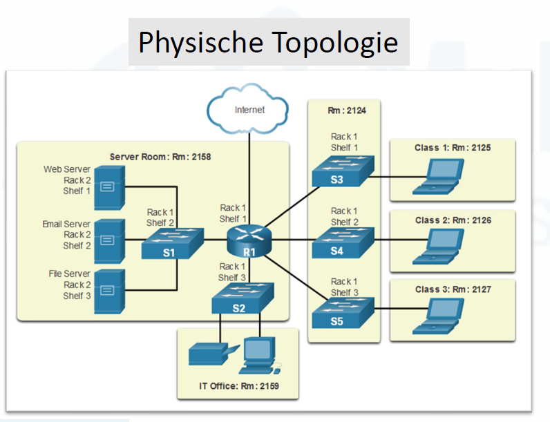
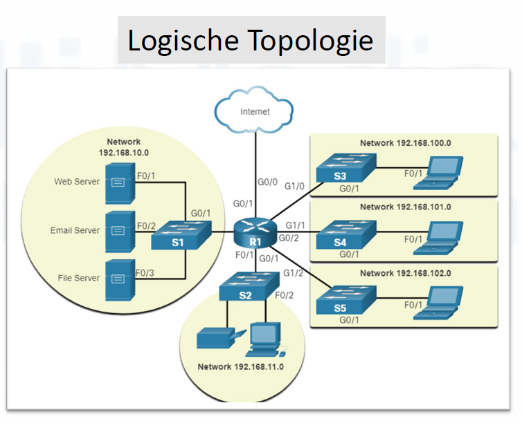

# 2. Netzwerktopologien

[⬅️ Previous](1. Netzwerk-Grundlagen.md) | [📚 Overview](README.md) | [Next ➡️](3.Hierarchische Netzwerkarchitektur.md)

---

Eine **Netzwerktopologie** beschreibt, wie ein Netzwerk aufgebaut ist und wie Geräte miteinander verbunden sind.

Dabei unterscheidet man zwischen:

1. **physikalischer Topologie**
2. **logischer Topologie**

Diese beiden Ansichten können gleich aussehen, müssen es aber nicht.

---

## Physikalische Topologie

Die **physikalische Topologie** beschreibt, wie die Geräte tatsächlich miteinander verbunden sind.

Sie zeigt also den echten Aufbau des Netzwerks.



Beispiel:

```text
PC ---- Switch ---- Router ---- Internet
```

Die physikalische Topologie beantwortet Fragen wie:

- Wo stehen die Geräte?
- Welche Geräte sind mit Kabel verbunden?
- Welche Ports werden verwendet?
- Welche Kabelwege gibt es?
- Wie sind Switches, Router, PCs oder Server physisch angeschlossen?

### Beispiel aus der Praxis

In einem Büro stehen mehrere PCs. Jeder PC ist mit einem Netzwerkkabel an einen Switch angeschlossen.

```text
PC1 ----\
PC2 ----- Switch ---- Router ---- Internet
PC3 ----/
```

Physikalisch sieht das wie eine **Stern-Topologie** aus, weil alle PCs mit einem zentralen Gerät, dem Switch, verbunden sind.

---

## Logische Topologie

Die **logische Topologie** beschreibt, wie die Daten im Netzwerk fließen.

Sie zeigt also nicht unbedingt die echten Kabel, sondern den Kommunikationsweg der Daten.



Beispiel:

```text
PC → Switch → Router → Internetserver
```

Die logische Topologie beantwortet Fragen wie:

- Welches Gerät kommuniziert mit welchem Gerät?
- Über welche Netzwerke oder Subnetze laufen die Daten?
- Welche IP-Adressen oder VLANs sind beteiligt?
- Wie ist der Datenfluss organisiert?
- Über welchen Router oder Switch laufen die Daten?

### Beispiel

Ein PC möchte eine Webseite aufrufen.

```text
PC → Switch → Router → Internet → Webserver
```

Der Datenfluss läuft vom PC über den Switch zum Router und dann ins Internet.

---

## Unterschied zwischen physikalischer und logischer Topologie

| Physikalische Topologie | Logische Topologie |
|---|---|
| Zeigt echte Kabel und Geräte | Zeigt den Datenfluss |
| Zeigt, wie Geräte wirklich verbunden sind | Zeigt, wie Geräte miteinander kommunizieren |
| Wichtig für Verkabelung und Fehlersuche | Wichtig für IP-Adressen, Routing und Netzwerkplanung |
| Beispiel: PC ist per Kabel mit Switch verbunden | Beispiel: PC sendet Daten an Server über Router |

### Einfaches Beispiel

Physikalisch:

```text
PC1 ---- Switch ---- PC2
```

Logisch:

```text
PC1 → PC2
```

Obwohl beide PCs physisch am Switch hängen, kommunizieren sie logisch direkt miteinander über das Netzwerk.

---

# Häufige Topologien

## 1. Stern-Topologie

Bei der **Stern-Topologie** sind alle Geräte mit einem zentralen Gerät verbunden, meistens mit einem Switch.

```text
        PC1
         |
PC2 -- Switch -- PC3
         |
        PC4
```

### Erklärung

Alle Geräte senden ihre Daten zuerst an den Switch. Der Switch leitet die Daten dann an das richtige Zielgerät weiter.

### Vorteile

- Sehr häufig in modernen LANs
- Einfach zu erweitern
- Fällt ein PC aus, funktioniert der Rest weiter
- Fehler lassen sich relativ leicht finden
- Gute Leistung durch Switches

### Nachteile

- Der zentrale Switch ist wichtig
- Fällt der Switch aus, funktioniert das Netzwerk nicht mehr
- Mehr Kabel notwendig als bei Bus-Topologie

### Praxisbeispiel

In Schulen, Büros und Firmen wird meistens eine Stern-Topologie verwendet. Jeder Arbeitsplatz-PC ist mit einem Switch verbunden.

---

## 2. Bus-Topologie

Bei der **Bus-Topologie** hängen alle Geräte an einer gemeinsamen Leitung.

```text
PC1 --- PC2 --- PC3 --- PC4
```

### Erklärung

Alle Geräte teilen sich dasselbe Kabel. Wenn ein Gerät Daten sendet, können diese grundsätzlich von allen Geräten auf der Leitung wahrgenommen werden.

### Vorteile

- Wenig Kabel notwendig
- Früher relativ einfach und günstig

### Nachteile

- Heute kaum noch verwendet
- Wenn das Hauptkabel beschädigt ist, kann das ganze Netzwerk ausfallen
- Viele Kollisionen möglich
- Schlechte Leistung bei vielen Geräten
- Fehlersuche ist schwierig

### Merksatz

Bei einer Bus-Topologie teilen sich alle Geräte eine gemeinsame Datenleitung.

---

## 3. Ring-Topologie

Bei der **Ring-Topologie** sind die Geräte ringförmig miteinander verbunden.

```text
PC1 ---- PC2
 |        |
PC4 ---- PC3
```

### Erklärung

Die Daten laufen in einem Kreis von Gerät zu Gerät weiter, bis sie beim Ziel angekommen sind.

### Vorteile

- Geregelter Datenverkehr möglich
- Keine oder wenige Kollisionen, je nach Technik

### Nachteile

- Fällt ein Gerät oder eine Verbindung aus, kann der Ring gestört sein
- Erweiterung ist aufwendiger
- Heute im klassischen LAN kaum noch üblich

### Praxisbezug

Ring-Topologien waren früher zum Beispiel bei Token-Ring-Netzwerken bekannt. Heute werden sie in normalen Büro-LANs kaum noch eingesetzt.

---

## 4. Mesh-Topologie / vermaschte Topologie

Bei einer **Mesh-Topologie** haben Geräte mehrere Verbindungen untereinander.

```text
     A ----- B
     |\     /|
     | \   / |
     |  \ /  |
     |  / \  |
     | /   \ |
     |/     \|
     C ----- D
```

### Erklärung

Es gibt mehrere mögliche Wege von einem Gerät zum anderen. Wenn ein Weg ausfällt, kann oft ein anderer Weg verwendet werden.

### Vorteile

- Sehr ausfallsicher
- Mehrere alternative Wege
- Gut für wichtige Netzwerkbereiche
- Geeignet für große Netzwerke oder Backbone-Verbindungen

### Nachteile

- Viele Kabel oder Verbindungen notwendig
- Teurer
- Aufwendiger zu planen und zu verwalten

### Praxisbeispiel

Im Internet und in großen Unternehmensnetzwerken gibt es oft vermaschte Strukturen. Dadurch können Daten bei Ausfall einer Verbindung einen anderen Weg nehmen.

---

## 5. Baum-Topologie / hierarchische Topologie

Eine **Baum-Topologie** besteht aus mehreren Stern-Topologien, die hierarchisch miteinander verbunden sind.

```text
             Router
               |
          Core-Switch
          /         \
   Switch 1       Switch 2
   /     \        /      \
 PC1    PC2     PC3     PC4
```

### Erklärung

Die Geräte sind in Ebenen organisiert. Unten befinden sich meist die Endgeräte, darüber Switches und Router.

Diese Struktur findet man häufig in größeren Firmennetzwerken.

---

# Hierarchische Netzwerkarchitektur

In größeren Netzwerken wird häufig eine **hierarchische Netzwerkarchitektur** verwendet.

Diese besteht meist aus drei Schichten:

1. **Access Layer**
2. **Distribution Layer**
3. **Core Layer**

---

## Access Layer

Der **Access Layer** ist die unterste Schicht.

Hier werden Endgeräte angeschlossen, zum Beispiel:

- PCs
- Drucker
- IP-Telefone
- Access Points
- Kameras

Beispiel:

```text
PC ---- Access-Switch
```

### Aufgabe

Der Access Layer ermöglicht den Geräten den Zugang zum Netzwerk.

---

## Distribution Layer

Der **Distribution Layer** verbindet mehrere Access-Switches miteinander.

Hier werden oft wichtige Netzwerkentscheidungen getroffen, zum Beispiel:

- Routing zwischen VLANs
- Filterung von Datenverkehr
- Zugriffskontrollen
- Verbindung verschiedener Netzwerkbereiche

Beispiel:

```text
Access-Switch 1 ----\
                     Distribution-Switch
Access-Switch 2 ----/
```

### Aufgabe

Der Distribution Layer sammelt und steuert den Datenverkehr aus mehreren Access-Bereichen.

---

## Core Layer

Der **Core Layer** ist die zentrale Hauptschicht eines großen Netzwerks.

Er verbindet die wichtigsten Netzwerkbereiche miteinander und sorgt für schnelle Datenweiterleitung.

Beispiel:

```text
Distribution-Switch ---- Core-Switch ---- Router/Internet
```

### Aufgabe

Der Core Layer soll Daten schnell und zuverlässig transportieren.

---

## Zusammenfassung der Schichten

| Schicht | Aufgabe | Typische Geräte |
|---|---|---|
| **Access Layer** | Endgeräte ans Netzwerk anschließen | Access-Switches |
| **Distribution Layer** | Netzwerkbereiche verbinden und steuern | Layer-3-Switches, Router |
| **Core Layer** | Schnelle Hauptverbindung im Netzwerk | Core-Switches, Router |

---

# Wichtige Begriffe

## Client

Ein **Client** ist ein Gerät oder Programm, das einen Dienst nutzt.

Beispiele:

- PC
- Laptop
- Smartphone
- Browser
- E-Mail-Programm

Beispiel:

Ein Browser auf einem PC ruft eine Webseite auf. Der PC ist dabei der Client.

---

## Server

Ein **Server** stellt Dienste oder Daten bereit.

Beispiele:

- Webserver
- Dateiserver
- Mailserver
- DNS-Server
- DHCP-Server

Beispiel:

Ein Webserver liefert eine Webseite an den Browser des Clients.

---

## Endgeräte

**Endgeräte** sind Geräte, die von Benutzern direkt verwendet werden oder Daten erzeugen bzw. empfangen.

Beispiele:

- PC
- Laptop
- Smartphone
- Drucker
- IP-Telefon
- Server

---

## Zwischengeräte

**Zwischengeräte** verbinden Endgeräte miteinander und leiten Daten weiter.

Beispiele:

- Switch
- Router
- Access Point
- Firewall

### Aufgaben von Zwischengeräten

- Daten weiterleiten
- Netzwerke verbinden
- Datenverkehr filtern
- WLAN bereitstellen
- Sicherheit erhöhen

---

# Beispiel für eine einfache Netzwerktopologie

```text
PC1 ----\
PC2 ----- Switch ----- Router ----- Internet
PC3 ----/                 |
                       Server
```

### Erklärung

- PC1, PC2 und PC3 sind Clients.
- Der Switch verbindet die Geräte im lokalen Netzwerk.
- Der Router verbindet das lokale Netzwerk mit dem Internet.
- Der Server stellt Dienste oder Daten bereit.
- Physikalisch sind die PCs sternförmig mit dem Switch verbunden.
- Logisch können die PCs über den Switch und Router mit dem Internet kommunizieren.

---

# Typische Prüfungsfragen

## Frage 1

Was ist der Unterschied zwischen physikalischer und logischer Topologie?

### Antwort

Die physikalische Topologie zeigt, wie Geräte tatsächlich mit Kabeln oder Funk verbunden sind. Die logische Topologie zeigt, wie Daten durch das Netzwerk fließen.

---

## Frage 2

Welche Topologie wird heute häufig in LANs verwendet?

### Antwort

Die Stern-Topologie mit Switches.

---

## Frage 3

Was ist ein Vorteil der Stern-Topologie?

### Antwort

Wenn ein einzelner PC ausfällt, funktioniert der Rest des Netzwerks weiterhin. Außerdem ist die Fehlersuche relativ einfach.

---

## Frage 4

Was ist ein Nachteil der Stern-Topologie?

### Antwort

Der zentrale Switch ist ein wichtiger Punkt. Wenn dieser Switch ausfällt, können die angeschlossenen Geräte nicht mehr miteinander kommunizieren.

---

## Frage 5

Was ist eine Mesh-Topologie?

### Antwort

Eine Mesh-Topologie ist eine vermaschte Topologie, bei der Geräte mehrere Verbindungen untereinander haben. Dadurch gibt es oft alternative Wege, falls eine Verbindung ausfällt.

---

## Merksätze

- Eine **Topologie** beschreibt den Aufbau eines Netzwerks.
- Die **physikalische Topologie** zeigt die echten Verbindungen.
- Die **logische Topologie** zeigt den Datenfluss.
- Im LAN wird heute meistens eine **Stern-Topologie mit Switches** verwendet.
- Eine **Mesh-Topologie** ist besonders ausfallsicher, aber aufwendiger und teurer.
- In großen Netzwerken nutzt man häufig eine **hierarchische Struktur** mit Access-, Distribution- und Core Layer.

---

[⬅️ Previous](1. Netzwerk-Grundlagen.md) | [📚 Overview](README.md) | [Next ➡️](3.Hierarchische Netzwerkarchitektur.md)
