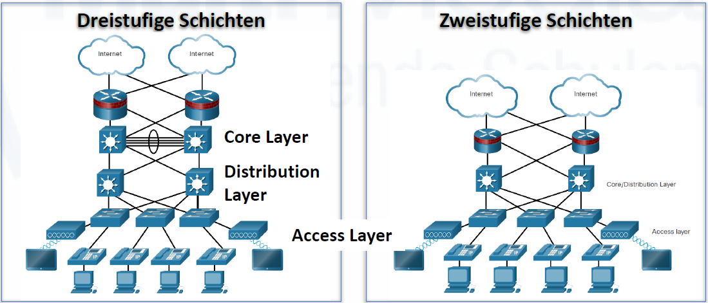
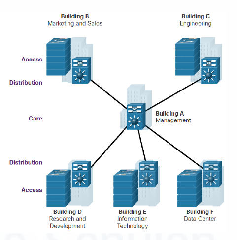
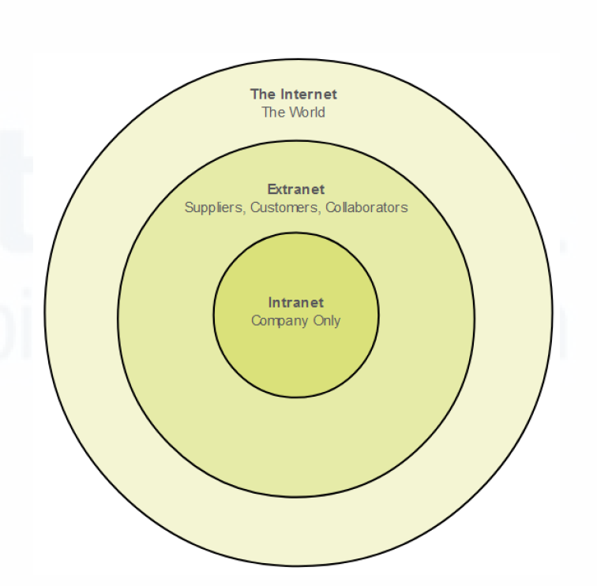
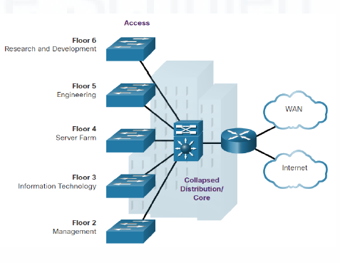
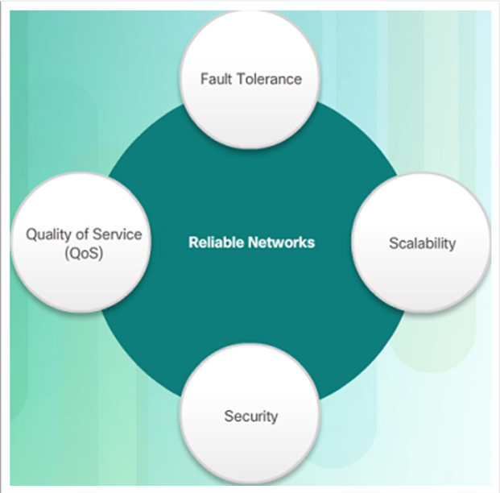
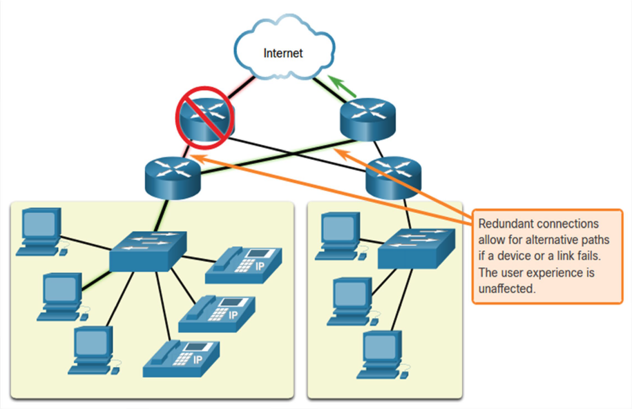
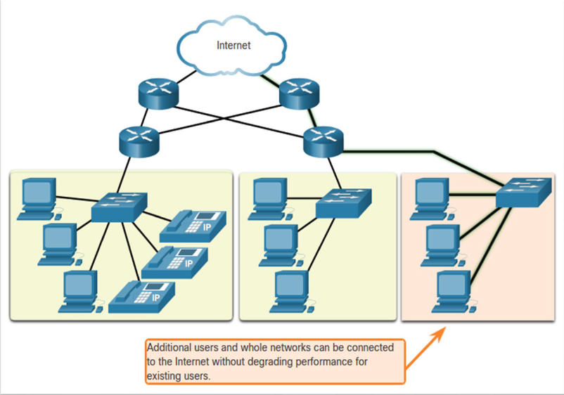
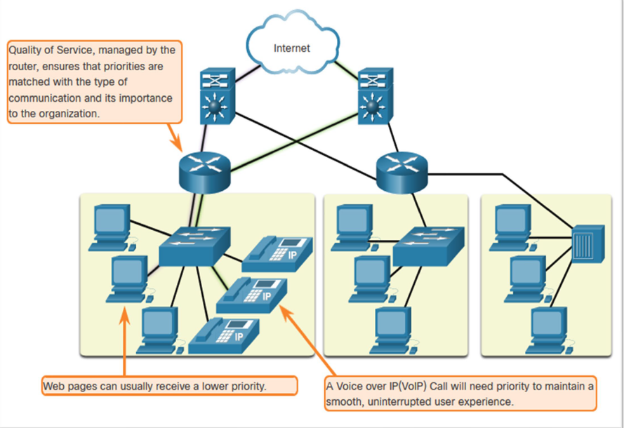
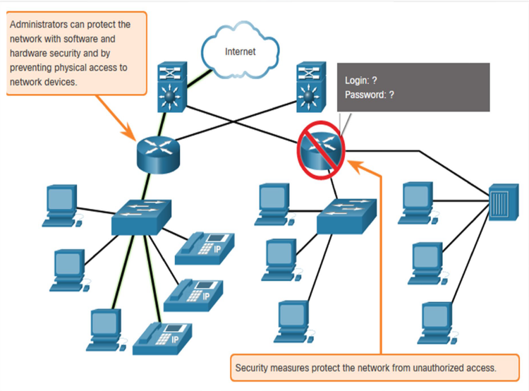
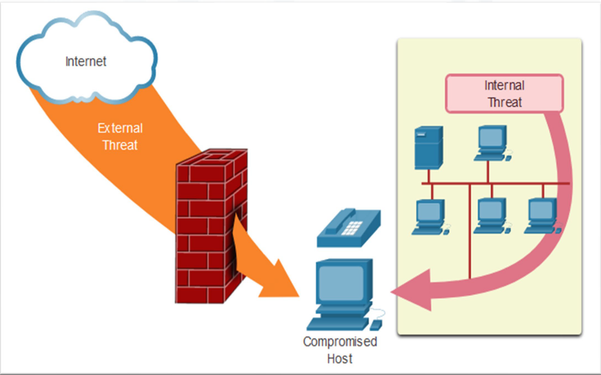

# 3. Hierarchische Netzwerkarchitektur

Größere Netzwerke werden oft hierarchisch in Schichten aufgebaut.

## Three-tier (Dreistufiges) Design

Das dreistufige Modell besteht aus Access-, Distribution- und Core-Layer.

| Schicht | Aufgabe | Typische Geräte |
|---|---|---|
| **Access Layer** | Endgeräte werden angeschlossen, z. B. PCs, Drucker, Access Points | Access-Switches |
| **Distribution Layer** | Verbindet Access-Switches, übernimmt Routing, Filterung, QoS und VLAN-Verteilung; kontrolliert Datenfluss zwischen Access- und Core-Layer | Layer-3-Switches, Router |
| **Core Layer** | Schnelles Highspeed-Backbone/Rückgrat mit redundanten Verbindungen; transportiert Daten zwischen Netzwerken | Core-Switches, Router |

Merksatz:

> Access = Zugang für Endgeräte  
> Distribution = Verteilung und Steuerung  
> Core = schnelles Zentrum

---

## Two-tier (Zweistufiges) Design / Collapsed Core

Wenn keine separaten Distribution- und Core-Layer benötigt werden, fasst man sie zu einem zusammen.

- Wird auch als **Collapsed Core Network Design** bezeichnet.
- Sinnvoll für kleinere Standorte oder Standorte in einem einzigen Gebäude.
- Einfacher und günstiger, da weniger Geräteebenen.

| Schicht | Aufgabe |
|---|---|
| **Access Layer** | Endgeräte anschließen |
| **Core/Distribution Layer** | Kombination aus Core und Distribution in einer Ebene |

---

## Zuverlässige Netzwerke

Eine gute Netzwerkarchitektur wird an vier Qualitäten gemessen:

### Fehlertoleranz

- Das Netzwerk bleibt bei einem Ausfall eines Pfades funktionsfähig.
- **Paketvermittlung** teilt Daten in Pakete auf, die unterschiedliche Wege nehmen können.
- Mehrere redundante Verbindungen sorgen für Ausfallsicherheit.

### Skalierbarkeit

- Ein skalierbares Netzwerk kann schnell wachsen, ohne Leistungseinbußen.
- Erreichbar durch die Einhaltung anerkannter Standards und Protokolle.

### Quality of Service (QoS)

- **QoS** priorisiert bestimmte Datenströme, z. B. Sprachkommunikation vor normalen Dateitransfers.
- Router und Switches können Datenpakete nach Priorität verwalten.
- Ziel: zuverlässige Bereitstellung zeitkritischer Inhalte für alle Nutzer.

### Sicherheit (CIA-Schutzziele)

Im Netzwerkkontext gibt es drei klassische Sicherheitsziele:

| Schutzziel | Bedeutung |
|---|---|
| **Vertraulichkeit** | Nur berechtigte Personen können die Daten lesen |
| **Integrität** | Daten werden während der Übertragung nicht verändert |
| **Verfügbarkeit** | Autorisierte Benutzer haben zuverlässigen Zugriff auf Dienste |

---

## Abfragefragen

1. Was ist eine physikalische Topologie?
2. Was ist eine logische Topologie?
3. Was ist eine Stern-Topologie?
4. Welche drei Schichten hat das dreistufige hierarchische Netzwerkdesign?
5. Was macht der Access Layer?
6. Was macht der Distribution Layer?
7. Was macht der Core Layer?
8. Was ist ein Collapsed Core / Two-tier Design?
9. Wann verwendet man ein Two-tier Design?
10. Was sind die vier Qualitätsmerkmale zuverlässiger Netzwerke?
11. Was bedeutet Fehlertoleranz im Netzwerk?
12. Was bedeutet QoS?
13. Was bedeutet Vertraulichkeit, Integrität und Verfügbarkeit?

---
