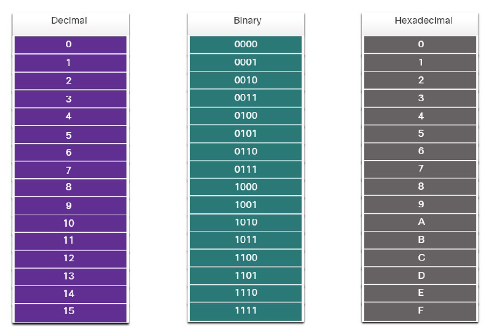

# 5. Zahlensysteme

In Netzwerken werden verschiedene Zahlensysteme verwendet, weil Computer intern anders „denken“ als Menschen.

Menschen rechnen meistens im **Dezimalsystem**, Computer arbeiten intern mit **Binärzahlen**, und zur übersichtlicheren Darstellung von langen Binärwerten nutzt man häufig das **Hexadezimalsystem**.

---

# 5.1 Dezimalsystem

Das **Dezimalsystem** ist das normale Zahlensystem, das wir im Alltag verwenden.

Es besteht aus den Ziffern:

```text
0 1 2 3 4 5 6 7 8 9
```

Die Basis ist **10**.

Beispiel:

```text
192
```

Die Zahl 192 bedeutet:

```text
1 × 100 + 9 × 10 + 2 × 1
```

Oder mit Zehnerpotenzen:

```text
1 × 10² + 9 × 10¹ + 2 × 10⁰
= 100 + 90 + 2
= 192
```

---

# 5.2 Binärsystem

Das **Binärsystem** ist das Zahlensystem der Computer.

Es besteht nur aus zwei Ziffern:

```text
0 und 1
```

Die Basis ist **2**.

Eine einzelne Stelle nennt man **Bit**.



Beispiel:

```text
11000000
```

Diese Binärzahl besteht aus 8 Bits.

8 Bits nennt man auch **1 Byte**.

In IPv4-Adressen besteht jeder Adressteil aus 8 Bit.

Beispiel IPv4-Adresse:

```text
192.168.0.1
```

Intern sieht sie so aus:

```text
11000000.10101000.00000000.00000001
```

---

## Stellenwerte im Binärsystem

Bei einer 8-Bit-Zahl haben die Stellen folgende Werte:

| Bit-Stelle | Wert |
|---|---:|
| 1. Stelle | 128 |
| 2. Stelle | 64 |
| 3. Stelle | 32 |
| 4. Stelle | 16 |
| 5. Stelle | 8 |
| 6. Stelle | 4 |
| 7. Stelle | 2 |
| 8. Stelle | 1 |

Man kann sich das so merken:

```text
128  64  32  16  8  4  2  1
```

Wenn an einer Stelle eine **1** steht, zählt dieser Wert mit.

Wenn dort eine **0** steht, zählt er nicht mit.

---

## Beispiel: Binär in Dezimal umrechnen

Binärzahl:

```text
11000000
```

Darunter die Stellenwerte:

```text
128 64 32 16 8 4 2 1
 1  1  0  0 0 0 0 0
```

Jetzt nur die Stellen addieren, bei denen eine 1 steht:

```text
128 + 64 = 192
```

Also:

```text
11000000₂ = 192₁₀
```

---

## Weiteres Beispiel

Binärzahl:

```text
10101000
```

Stellenwerte:

```text
128 64 32 16 8 4 2 1
 1  0  1  0 1 0 0 0
```

Addieren:

```text
128 + 32 + 8 = 168
```

Also:

```text
10101000₂ = 168₁₀
```

---

# 5.3 Dezimal in Binär umrechnen

Um eine Dezimalzahl in Binär umzuwandeln, kann man die Stellenwerte von links nach rechts prüfen.

Beispiel:

```text
192
```

Stellenwerte:

```text
128 64 32 16 8 4 2 1
```

Frage:

Passt 128 in 192?

Ja, also 1.

```text
192 - 128 = 64
```

Passt 64 in den Rest 64?

Ja, also 1.

```text
64 - 64 = 0
```

Alle weiteren Stellen sind 0.

Ergebnis:

```text
192 = 11000000
```

---

## Beispiel: 168 in Binär

Stellenwerte:

```text
128 64 32 16 8 4 2 1
```

Rechnung:

```text
168 - 128 = 40
64 passt nicht in 40 → 0
40 - 32 = 8
16 passt nicht in 8 → 0
8 - 8 = 0
Restliche Stellen → 0
```

Ergebnis:

```text
168 = 10101000
```

---

# 5.4 Hexadezimalsystem

Das **Hexadezimalsystem** wird oft in der Informatik verwendet, weil es Binärzahlen kompakter darstellt.

Die Basis ist **16**.

Es verwendet folgende Zeichen:

```text
0 1 2 3 4 5 6 7 8 9 A B C D E F
```

| Dezimal | Hexadezimal |
|---:|---:|
| 0 | 0 |
| 1 | 1 |
| 2 | 2 |
| 3 | 3 |
| 4 | 4 |
| 5 | 5 |
| 6 | 6 |
| 7 | 7 |
| 8 | 8 |
| 9 | 9 |
| 10 | A |
| 11 | B |
| 12 | C |
| 13 | D |
| 14 | E |
| 15 | F |

---

## Warum Hexadezimal?

Binärzahlen können sehr lang werden.

Beispiel:

```text
11111111
```

Das ist dezimal:

```text
255
```

In Hexadezimal ist es nur:

```text
FF
```

Das ist deutlich kürzer.

---

# 5.5 Zusammenhang zwischen Binär und Hexadezimal

Eine Hexadezimalstelle entspricht genau **4 Bit**.

4 Bit nennt man auch **Nibble**.

Beispiel:

| Binär | Hex |
|---|---|
| 0000 | 0 |
| 0001 | 1 |
| 0010 | 2 |
| 0011 | 3 |
| 0100 | 4 |
| 0101 | 5 |
| 0110 | 6 |
| 0111 | 7 |
| 1000 | 8 |
| 1001 | 9 |
| 1010 | A |
| 1011 | B |
| 1100 | C |
| 1101 | D |
| 1110 | E |
| 1111 | F |

---

## Beispiel: Binär in Hexadezimal

Binärzahl:

```text
11000000
```

In zwei 4-Bit-Blöcke aufteilen:

```text
1100 0000
```

Jetzt jeden Block umwandeln:

```text
1100 = C
0000 = 0
```

Also:

```text
11000000₂ = C0₁₆
```

Dezimal ist das:

```text
192
```

---

## Beispiel: Hexadezimal in Binär

Hexadezimalzahl:

```text
A4
```

Jede Hex-Stelle in 4 Bit umwandeln:

```text
A = 1010
4 = 0100
```

Also:

```text
A4₁₆ = 10100100₂
```

---

# 5.6 Verwendung in Netzwerken

## IPv4-Adressen

IPv4-Adressen werden meistens dezimal dargestellt.

Beispiel:

```text
192.168.0.1
```

Jeder Abschnitt, also jedes sogenannte **Oktett**, hat 8 Bit.

Eine IPv4-Adresse besteht aus 4 Oktetten:

```text
192 . 168 . 0 . 1
```

In Binär:

```text
11000000.10101000.00000000.00000001
```

IPv4 hat insgesamt:

```text
4 × 8 Bit = 32 Bit
```

---

## Subnetzmasken

Subnetzmasken werden ebenfalls oft dezimal dargestellt.

Beispiel:

```text
255.255.255.0
```

Binär:

```text
11111111.11111111.11111111.00000000
```

Diese Subnetzmaske entspricht:

```text
/24
```

Warum?

Weil 24 Einsen in der Subnetzmaske stehen.

```text
11111111 = 8 Einsen
11111111 = 8 Einsen
11111111 = 8 Einsen
00000000 = 0 Einsen

8 + 8 + 8 + 0 = 24
```

---

## MAC-Adressen

MAC-Adressen werden meistens hexadezimal dargestellt.

Beispiel:

```text
A4:B1:C1:22:7F:09
```

Eine MAC-Adresse besteht aus 48 Bit.

Sie wird in 6 Blöcken dargestellt.

Jeder Block hat 2 Hexadezimalstellen.

```text
A4 : B1 : C1 : 22 : 7F : 09
```

Jeder Hex-Block entspricht 8 Bit.

Beispiel:

```text
A4 = 10100100
```

---

# 5.7 Wichtige Binärwerte für IPv4-Subnetzmasken

Diese Werte sollte man für Subnetting gut kennen:

| Dezimal | Binär |
|---:|---|
| 0 | 00000000 |
| 128 | 10000000 |
| 192 | 11000000 |
| 224 | 11100000 |
| 240 | 11110000 |
| 248 | 11111000 |
| 252 | 11111100 |
| 254 | 11111110 |
| 255 | 11111111 |

Diese Werte kommen bei Subnetzmasken vor, weil eine Subnetzmaske von links nach rechts aus Einsen besteht.

Beispiel:

```text
255.255.255.192
```

Binär:

```text
11111111.11111111.11111111.11000000
```

Die letzte Zahl 192 entspricht:

```text
11000000
```

Daher hat diese Maske:

```text
8 + 8 + 8 + 2 = 26 Einsen
```

Also:

```text
255.255.255.192 = /26
```

---

# 5.8 Kurze Merkhilfen

## Binär-Stellenwerte merken

```text
128 64 32 16 8 4 2 1
```

Jeder Wert halbiert sich von links nach rechts.

---

## Subnetzmaskenwerte merken

```text
0, 128, 192, 224, 240, 248, 252, 254, 255
```

Oder als Bitmuster:

```text
00000000 = 0
10000000 = 128
11000000 = 192
11100000 = 224
11110000 = 240
11111000 = 248
11111100 = 252
11111110 = 254
11111111 = 255
```

---

# Übungen mit Lösungen

## Übung 1: Binär in Dezimal umrechnen

Rechne die folgenden Binärzahlen in Dezimalzahlen um.

### Aufgaben

a)

```text
00000001
```

b)

```text
00001010
```

c)

```text
11000000
```

d)

```text
11111111
```

e)

```text
10101000
```

---

### Lösungen

a)

```text
00000001 = 1
```

b)

```text
00001010
= 8 + 2
= 10
```

c)

```text
11000000
= 128 + 64
= 192
```

d)

```text
11111111
= 128 + 64 + 32 + 16 + 8 + 4 + 2 + 1
= 255
```

e)

```text
10101000
= 128 + 32 + 8
= 168
```

---

## Übung 2: Dezimal in Binär umrechnen

Wandle die folgenden Dezimalzahlen in 8-Bit-Binärzahlen um.

### Aufgaben

a)

```text
0
```

b)

```text
1
```

c)

```text
10
```

d)

```text
192
```

e)

```text
255
```

f)

```text
172
```

---

### Lösungen

a)

```text
0 = 00000000
```

b)

```text
1 = 00000001
```

c)

```text
10 = 00001010
```

d)

```text
192 = 11000000
```

e)

```text
255 = 11111111
```

f)

```text
172
= 128 + 32 + 8 + 4

128 64 32 16 8 4 2 1
 1  0  1  0 1 1 0 0

172 = 10101100
```

---

## Übung 3: IPv4-Adresse in Binär umwandeln

Wandle die IPv4-Adresse in Binär um.

### Aufgabe

```text
192.168.0.1
```

---

### Lösung

```text
192 = 11000000
168 = 10101000
0   = 00000000
1   = 00000001
```

Also:

```text
192.168.0.1
=
11000000.10101000.00000000.00000001
```

---

## Übung 4: Binäre IPv4-Adresse in Dezimal umwandeln

Wandle die folgende IPv4-Adresse in Dezimal um.

### Aufgabe

```text
11000000.10101000.00000001.00001010
```

---

### Lösung

```text
11000000 = 192
10101000 = 168
00000001 = 1
00001010 = 10
```

Also:

```text
11000000.10101000.00000001.00001010
=
192.168.1.10
```

---

## Übung 5: Subnetzmaske erkennen

Bestimme die Präfixlänge.

### Aufgabe

```text
255.255.255.0
```

---

### Lösung

```text
255 = 11111111 = 8 Einsen
255 = 11111111 = 8 Einsen
255 = 11111111 = 8 Einsen
0   = 00000000 = 0 Einsen
```

Also:

```text
8 + 8 + 8 + 0 = 24
```

Ergebnis:

```text
255.255.255.0 = /24
```

---

## Übung 6: Subnetzmaske in Präfix umwandeln

Bestimme die Präfixlänge.

### Aufgaben

a)

```text
255.0.0.0
```

b)

```text
255.255.0.0
```

c)

```text
255.255.255.128
```

d)

```text
255.255.255.192
```

e)

```text
255.255.255.252
```

---

### Lösungen

a)

```text
255.0.0.0
= 11111111.00000000.00000000.00000000
= /8
```

b)

```text
255.255.0.0
= 11111111.11111111.00000000.00000000
= /16
```

c)

```text
255.255.255.128
= 11111111.11111111.11111111.10000000
= /25
```

d)

```text
255.255.255.192
= 11111111.11111111.11111111.11000000
= /26
```

e)

```text
255.255.255.252
= 11111111.11111111.11111111.11111100
= /30
```

---

## Übung 7: Präfix in Subnetzmaske umwandeln

Wandle die Präfixlänge in eine Subnetzmaske um.

### Aufgaben

a)

```text
/24
```

b)

```text
/25
```

c)

```text
/26
```

d)

```text
/27
```

e)

```text
/30
```

---

### Lösungen

a)

```text
/24
= 24 Einsen
= 11111111.11111111.11111111.00000000
= 255.255.255.0
```

b)

```text
/25
= 25 Einsen
= 11111111.11111111.11111111.10000000
= 255.255.255.128
```

c)

```text
/26
= 26 Einsen
= 11111111.11111111.11111111.11000000
= 255.255.255.192
```

d)

```text
/27
= 27 Einsen
= 11111111.11111111.11111111.11100000
= 255.255.255.224
```

e)

```text
/30
= 30 Einsen
= 11111111.11111111.11111111.11111100
= 255.255.255.252
```

---

## Übung 8: Hexadezimal in Dezimal

Wandle die folgenden Hexadezimalwerte in Dezimal um.

### Aufgaben

a)

```text
A
```

b)

```text
F
```

c)

```text
10
```

d)

```text
1F
```

e)

```text
FF
```

---

### Lösungen

a)

```text
A = 10
```

b)

```text
F = 15
```

c)

```text
10₁₆
= 1 × 16 + 0
= 16
```

d)

```text
1F₁₆
= 1 × 16 + 15
= 31
```

e)

```text
FF₁₆
= 15 × 16 + 15
= 240 + 15
= 255
```

---

## Übung 9: Hexadezimal in Binär

Wandle die Hexadezimalwerte in Binär um.

### Aufgaben

a)

```text
A4
```

b)

```text
FF
```

c)

```text
C0
```

d)

```text
7F
```

---

### Lösungen

a)

```text
A = 1010
4 = 0100

A4 = 10100100
```

b)

```text
F = 1111
F = 1111

FF = 11111111
```

c)

```text
C = 1100
0 = 0000

C0 = 11000000
```

d)

```text
7 = 0111
F = 1111

7F = 01111111
```

---

## Übung 10: Binär in Hexadezimal

Wandle die Binärzahlen in Hexadezimal um.

### Aufgaben

a)

```text
11111111
```

b)

```text
11000000
```

c)

```text
10100100
```

d)

```text
00001111
```

---

### Lösungen

a)

```text
11111111
= 1111 1111
= F F
= FF
```

b)

```text
11000000
= 1100 0000
= C 0
= C0
```

c)

```text
10100100
= 1010 0100
= A 4
= A4
```

d)

```text
00001111
= 0000 1111
= 0 F
= 0F
```

---

# Mini-Test zum Abfragen

Ein Freund kann dich zum Beispiel so abfragen:

## Frage 1

Wie viele Bits hat ein Byte?

### Antwort

```text
8 Bit
```

---

## Frage 2

Wie viele Bits hat eine IPv4-Adresse?

### Antwort

```text
32 Bit
```

---

## Frage 3

Wie viele Bits hat eine MAC-Adresse?

### Antwort

```text
48 Bit
```

---

## Frage 4

Welche Stellenwerte hat eine 8-Bit-Binärzahl?

### Antwort

```text
128, 64, 32, 16, 8, 4, 2, 1
```

---

## Frage 5

Was ist 11111111 in Dezimal?

### Antwort

```text
255
```

---

## Frage 6

Was ist 11000000 in Dezimal?

### Antwort

```text
192
```

---

## Frage 7

Was ist 192 in Binär?

### Antwort

```text
11000000
```

---

## Frage 8

Was ist 255.255.255.0 als Präfix?

### Antwort

```text
/24
```

---

## Frage 9

Was ist /26 als Subnetzmaske?

### Antwort

```text
255.255.255.192
```

---

## Frage 10

Wofür wird Hexadezimal häufig verwendet?

### Antwort

```text
Zum Beispiel für MAC-Adressen.
```

---

# Besonders klausurrelevant

Diese Werte solltest du sicher können:

```text
128 64 32 16 8 4 2 1
```

Und diese Subnetzmaskenwerte:

| Präfix im Oktett | Binär | Dezimal |
|---:|---|---:|
| /0 | 00000000 | 0 |
| /1 | 10000000 | 128 |
| /2 | 11000000 | 192 |
| /3 | 11100000 | 224 |
| /4 | 11110000 | 240 |
| /5 | 11111000 | 248 |
| /6 | 11111100 | 252 |
| /7 | 11111110 | 254 |
| /8 | 11111111 | 255 |

Beispiele:

```text
/24 = 255.255.255.0
/25 = 255.255.255.128
/26 = 255.255.255.192
/27 = 255.255.255.224
/28 = 255.255.255.240
/29 = 255.255.255.248
/30 = 255.255.255.252
```