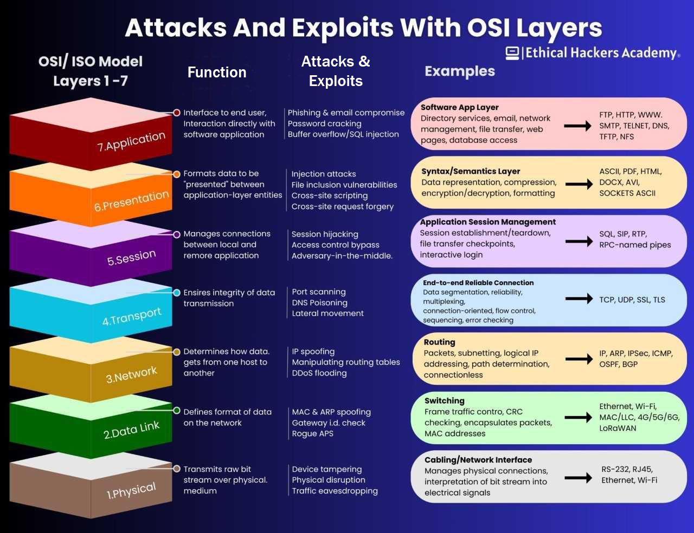
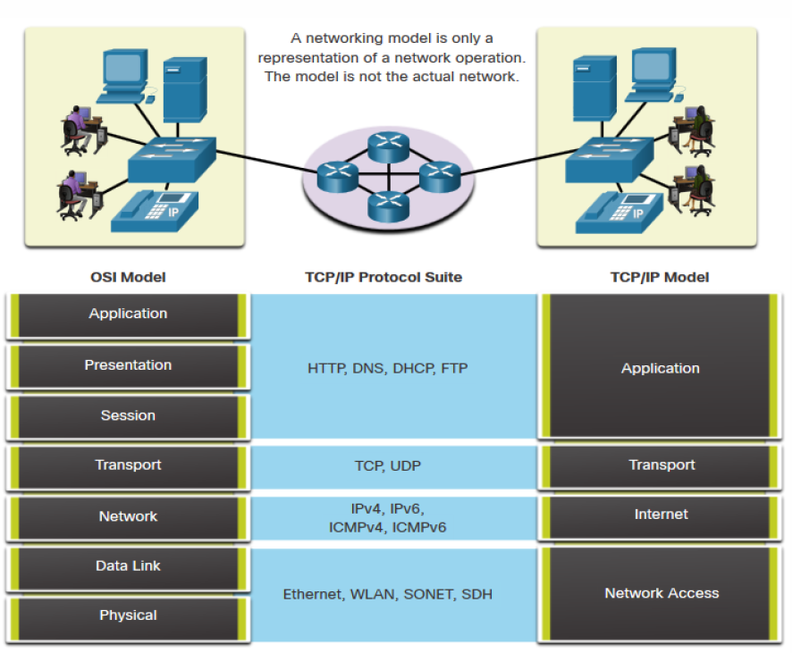
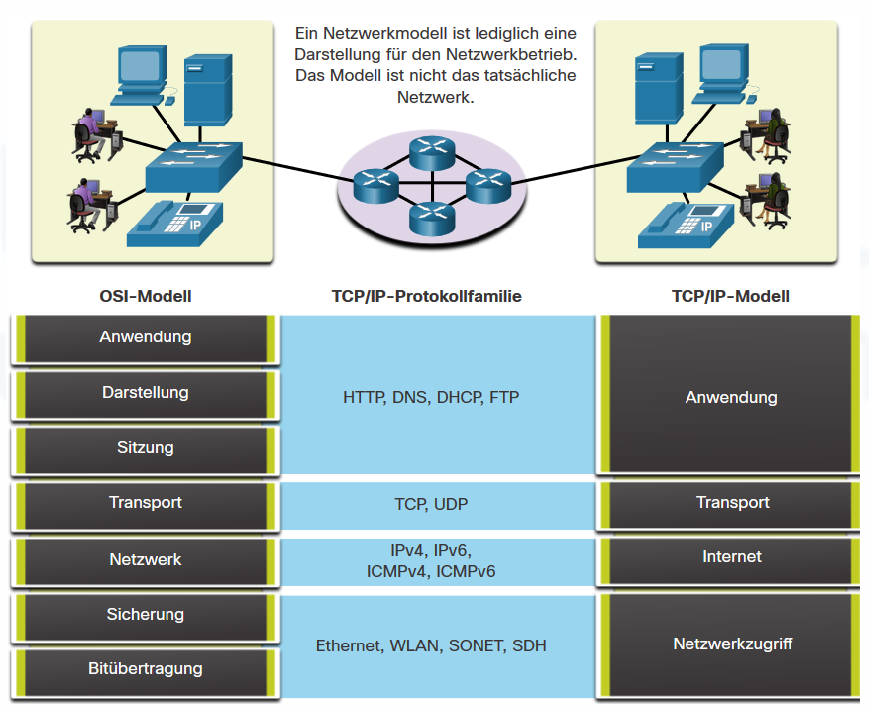
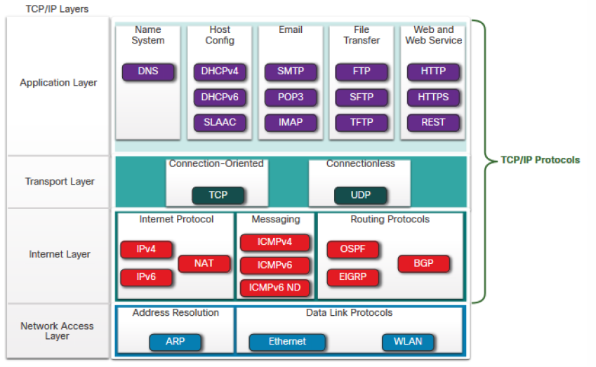

# 6. OSI-Modell und TCP/IP-Modell

[⬅️ Previous](5. Zahlensysteme.md) | [📚 Overview](README.md) | [Next ➡️](7. Physical Layer.md)

---

## OSI-Modell

Das OSI-Modell hat 7 Schichten.

| Schicht | Name | Aufgabe |
|---|---|---|
| 7 | Application | Anwendungen, z. B. HTTP, SMTP, DNS |
| 6 | Presentation | Darstellung, Verschlüsselung, Formatierung |
| 5 | Session | Sitzungen verwalten |
| 4 | Transport | TCP/UDP, Ende-zu-Ende-Kommunikation |
| 3 | Network | IP-Adressen, Routing |
| 2 | Data Link | MAC-Adressen, Ethernet, Frames, Switches |
| 1 | Physical | Kabel, Stecker, Signale, Funk |

---

## Besonders wichtig für LF3

| OSI-Schicht | Thema |
|---|---|
| **Layer 1 Physical** | Kabel, Signale, Übertragungsmedien |
| **Layer 2 Data Link** | Ethernet, MAC-Adressen, Switches |
| **Layer 3 Network** | IP-Adressen, Routing, Router |

---

## TCP/IP-Modell

| TCP/IP-Schicht | Entspricht ungefähr OSI |
|---|---|
| Application | OSI 5 bis 7 |
| Transport | OSI 4 |
| Internet | OSI 3 |
| Network Access | OSI 1 bis 2 |

---

## Abfragefragen

1. Wie viele Schichten hat das OSI-Modell?
2. Welche Schicht ist der Physical Layer?
3. Welche Schicht ist der Data Link Layer?
4. Welche Schicht ist der Network Layer?
5. Auf welcher Schicht arbeitet Ethernet hauptsächlich?
6. Auf welcher Schicht arbeitet IP?
7. Auf welcher Schicht arbeitet TCP?

---

[⬅️ Previous](5. Zahlensysteme.md) | [📚 Overview](README.md) | [Next ➡️](7. Physical Layer.md)
