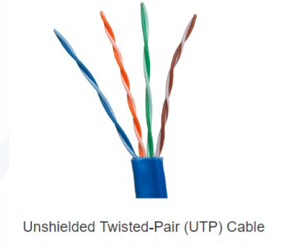
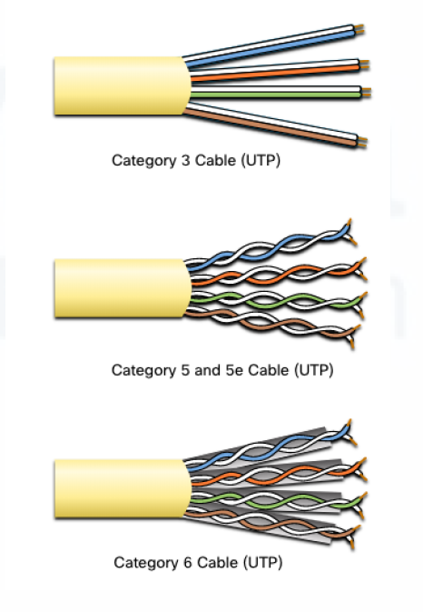
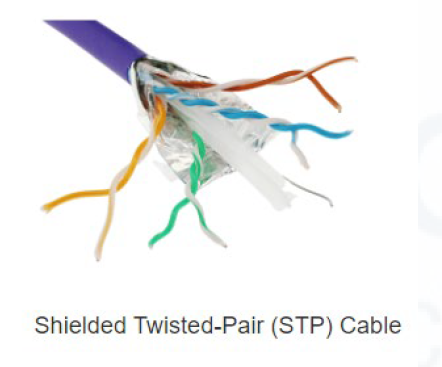
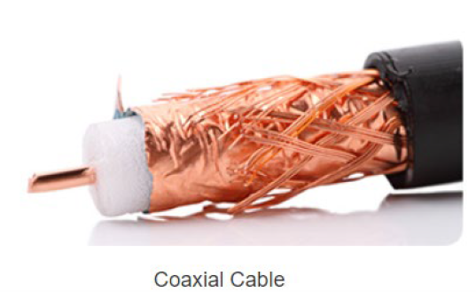
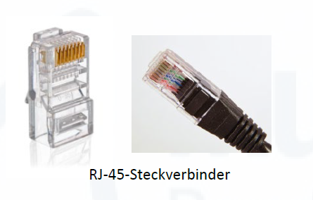
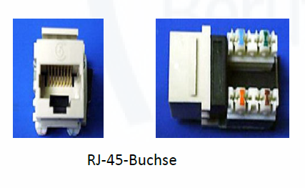
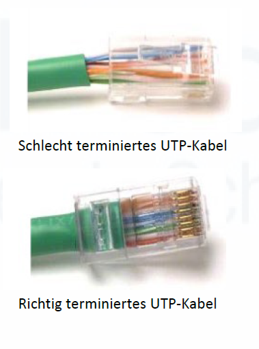

# 7. Physical Layer

Der **Physical Layer** ist OSI-Schicht 1.

Er beschäftigt sich mit der physischen Übertragung von Daten.

Dazu gehören:

- Netzwerkkabel
- Stecker
- elektrische Signale
- Lichtsignale
- Funkwellen
- Übertragungsmedien

---

## Übertragungsmedien

| Medium | Erklärung |
|---|---|
| **Kupferkabel** | z. B. Twisted-Pair-Kabel mit RJ45-Stecker; überträgt elektrische Signale |
| **Glasfaser** | Übertragung mit Licht (Laser oder LED), sehr schnell und immun gegen EMI/RFI |
| **Funk** | WLAN, Bluetooth, Mobilfunk; überträgt elektromagnetische Wellen |

---

## Kupferverkabelung (UTP)

UTP steht für **Unshielded Twisted Pair** (ungeschirmtes verdrilltes Adernpaar).

### Eigenschaften

- Vier farbkodierte Drahtpaare, miteinander verdreht, in einem Kunststoffmantel
- Keine metallische Abschirmung
- Stecker: **RJ-45**
- Standards: **TIA/EIA-568**





### Wie UTP Crosstalk verhindert (Cancellation)

UTP nutzt zwei Mechanismen:

1. **Cancellation (Gegentaktprinzip)**: Jeder Draht in einem Paar hat entgegengesetzte Polarität. Die Magnetfelder heben sich gegenseitig auf und verhindern EMI/RFI von außen.
2. **Verdrillungsvariation**: Jedes Drahtpaar hat eine andere Anzahl von Verdrillungen pro Fuß. Das verhindert Übersprechen (Crosstalk) zwischen den Paaren.











### Kategorien (Beispiele)

| Kategorie | Verwendung |
|---|---|
| Kategorie 3 | ältere Telefonverkabelung |
| Kategorie 5 / 5e | Fast Ethernet / Gigabit Ethernet |
| Kategorie 6 | Gigabit Ethernet und schneller |

---

## Glasfaserverkabelung

### Eigenschaften

- Überträgt Daten als **Lichtimpulse** (Laser oder LED)
- Über sehr große Entfernungen und mit sehr hoher Geschwindigkeit
- Immun gegen EMI und RFI
- Kein Crosstalk

### Steckverbindertypen

| Steckverbinder | Kürzel | Hinweis |
|---|---|---|
| **Straight-Tip** | ST | älterer Steckverbinder, Bajonettverschluss |
| **Subscriber Connector** | SC | quadratischer Stecker, häufig in LANs |
| **Lucent Connector Simplex** | LC | kleiner Stecker, heute sehr verbreitet |
| **Duplex-Multimode-LC** | LC-Duplex | zwei LC-Stecker zusammen, für Sende- und Empfangsrichtung |

### Vier Verwendungsbereiche

1. **Unternehmensnetzwerke**: Backbone-Verkabelung zwischen aktiven Netzwerkkomponenten (z. B. Switches)
2. **Fiber-to-the-Home (FTTH)**: Breitbandanschluss direkt ins Haus oder kleine Firma
3. **Langstreckennetze**: Service-Provider verbinden Städte und Länder
4. **Unterseekabel**: Hochgeschwindigkeitsverbindungen über Ozeane hinweg

---

## Kabellose Datenübertragung (Funk)

WLANs und andere Funknetze haben spezifische Einschränkungen:

| Einschränkung | Erklärung |
|---|---|
| **Abdeckungsbereich** | Wände und physische Hindernisse können die Reichweite stark einschränken |
| **Interferenz** | Viele gängige Geräte (z. B. Mikrowelle, andere WLANs) können stören |
| **Sicherheit** | Funksignale können ohne physischen Zugang abgehört werden |
| **Gemeinsam genutztes Medium / Halbduplex** | WLAN arbeitet im **Halbduplex**-Modus: Es kann immer nur ein Gerät gleichzeitig senden oder empfangen. Bei vielen Nutzern sinkt die verfügbare Bandbreite pro Gerät. |

---

## Störquellen

| Störquelle | Erklärung |
|---|---|
| **EMI** | Elektromagnetische Interferenzen, z. B. durch Stromleitungen |
| **RFI** | Hochfrequenzstörungen, z. B. durch Funkquellen |
| **Crosstalk** | Übersprechen zwischen Adern oder Kabeln |
| **Dämpfung** | Signalverlust über lange Kabelstrecken |

---

## Kennzahlen

| Begriff | Bedeutung |
|---|---|
| **Bandbreite** | Maximale Kapazität eines Mediums zur Datenübertragung (vom Provider angegeben) |
| **Latenz** | Zeitverzögerung bei der Datenübertragung |
| **Throughput** | Tatsächlich übertragene Datenmenge pro Zeiteinheit |
| **Goodput** | Nutzdatenrate = Throughput minus Protokoll-Overhead und Wiederholungen |

Formel:

```text
Goodput = Throughput - Traffic-Overhead
```

Beispiel:

Wenn insgesamt 100 Mbit/s übertragen werden, aber davon nur 90 Mbit/s echte Nutzdaten sind, beträgt der **Goodput 90 Mbit/s**.

---

## Standardorganisationen

| Organisation | Bedeutung |
|---|---|
| **IEEE** | Standards für Ethernet und WLAN, z. B. 802.3 und 802.11 |
| **ISO** | OSI-Modell |
| **IETF** | Internetstandards, RFCs |
| **TIA/EIA** | Verkabelungsstandards (z. B. TIA/EIA-568 für UTP) |

---

## Abfragefragen

1. Was macht der Physical Layer?
2. Welche drei Übertragungsmedien gibt es?
3. Was ist Latenz?
4. Was ist Throughput?
5. Was ist Goodput?
6. Was ist Crosstalk?
7. Warum ist Glasfaser weniger störanfällig als Kupfer?
8. Wie verhindert UTP Crosstalk? (Cancellation + Verdrillungsvariation)
9. Nenne vier Glasfaser-Steckverbindertypen.
10. Nenne die vier Verwendungsbereiche von Glasfaser.
11. Was bedeutet Halbduplex bei WLAN?
12. Welche vier Einschränkungen hat Funk gegenüber Kabel?

---
