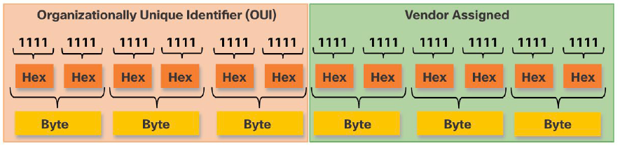
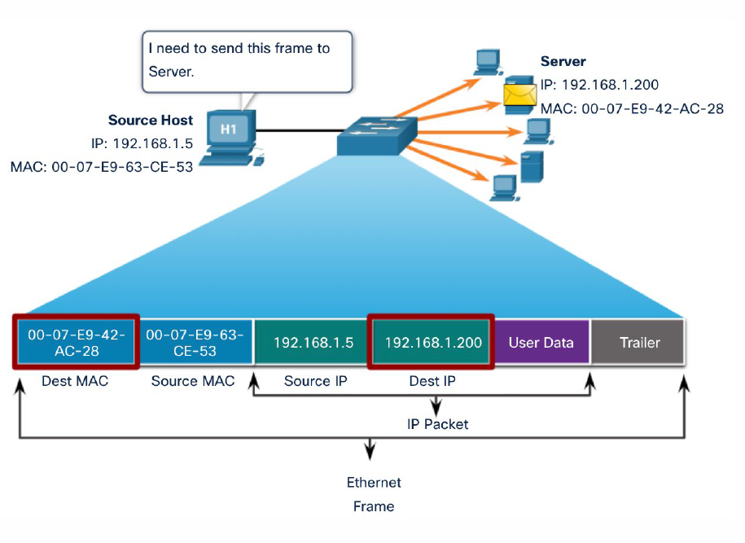
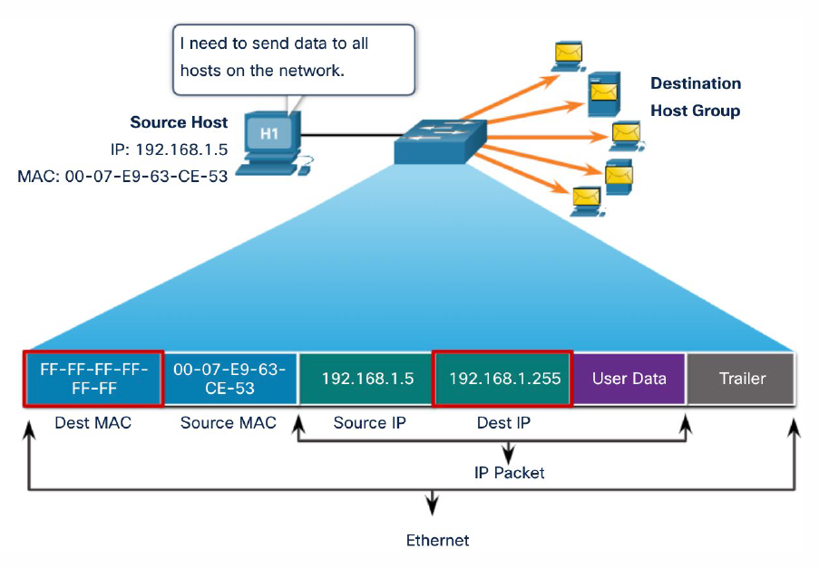
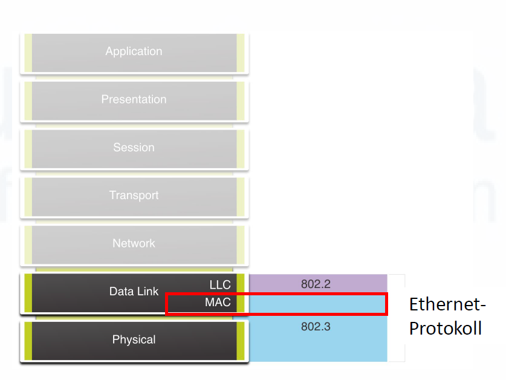
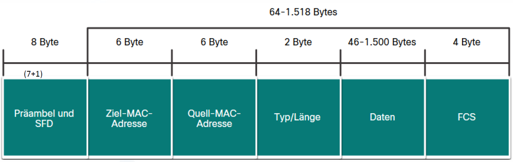
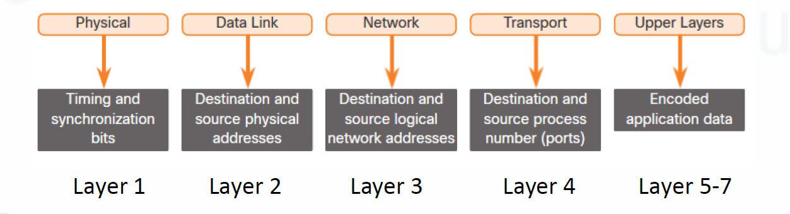

# 8. Ethernet und Switching

## Ethernet

Ethernet ist die wichtigste Technik für kabelgebundene lokale Netzwerke.

Ethernet verwendet:

- MAC-Adressen
- Frames
- Switches
- Netzwerkkabel

---

## MAC-Adresse

Eine **MAC-Adresse** ist die Hardwareadresse einer Netzwerkkarte.

Beispiel:

```text
A4:B1:C1:22:7F:09
```

Eigenschaften:

- 48 Bit lang
- meistens hexadezimal dargestellt
- dient zur Kommunikation im lokalen Netzwerk
- arbeitet auf OSI-Schicht 2







---

## OUI

Die ersten 24 Bit einer MAC-Adresse heißen **OUI**.

OUI bedeutet:

```text
Organizationally Unique Identifier
```

Sie kennzeichnen den Hersteller der Netzwerkkarte.

Beispiel:

```text
A4:B1:C1:22:7F:09
```

`A4:B1:C1` ist der OUI-Bereich.







---
